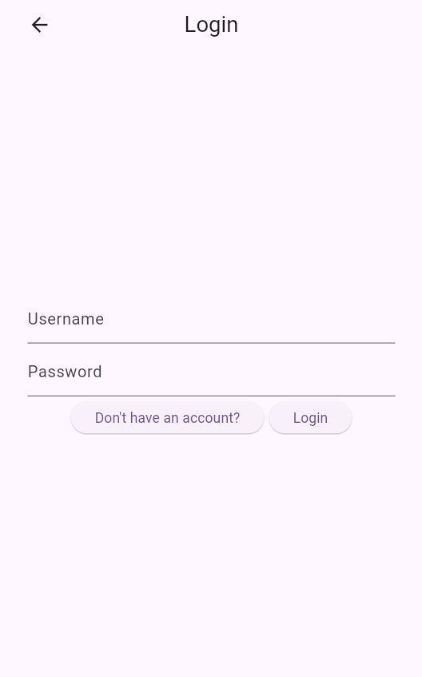
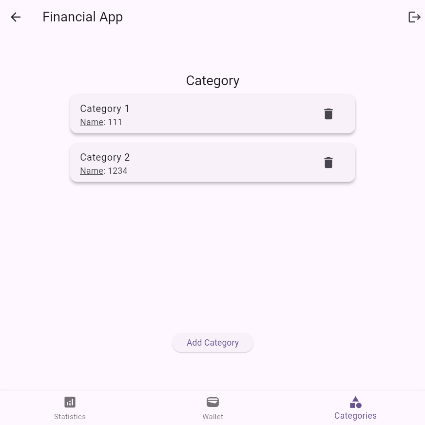
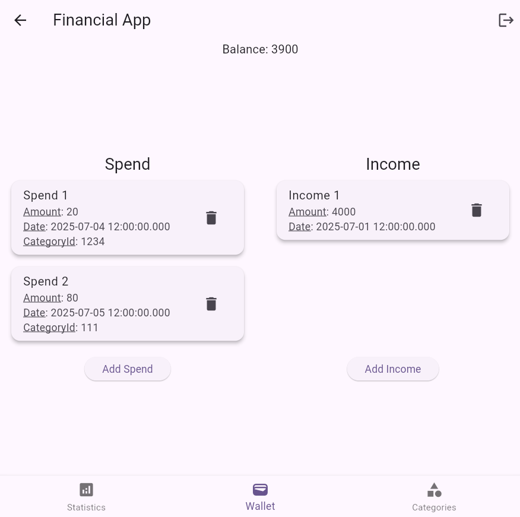
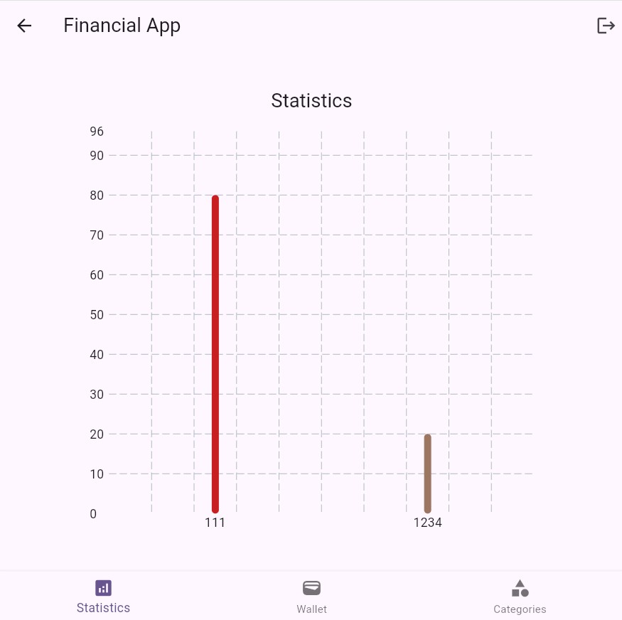

# Personal Finance Tracker

This is a flutter project aimed at helping individuals manage their financial
operations.

The project is deployed, using firebase, in domain
https://flutter-sample-1-29965.web.app

## Functional Requirements

First, the project includes accounting functionalities. These requirements
include register, login, and logout. After opening the application, if the
individual is not logged in, they will be redirected to the login page, located
in /account. At that page, if they have not created an account before, they will
be redirected to the registration page. After registration or logging in, the
individuals will be redirected to the dashboard page. Moreover, after logging
in, the individual always has the chance to logout on the top right of the
dashboard page.

Second, there are requirements related to categories. These include adding and
retrieving categories. The individual can access these requirements on the
"Category" tab of the dashboard.

Third, there are requirements related to incomes and spends. Each Income can
have a special date and an amount. They represent each income the individual
received. The spends are similar to income, but they represent the amount of
money the individual has spent. In addition, they have a certain category. The
individual can add and retrieve spends and incomes on the Wallet tab of the
dashboard.

Finally, there are requirements related to the statistics. These can be accessed
through the statistics tab of the dashboard. At the moment, the only requirement
in this tab, which you can access through the statistics tab, is seeing a bar
chart of total spent per category.

## UI Constraints

The dashboard is responsive. Each subpage on the dashboard has two width
breakpoints, mobile and tablet. mobile is any width below 500px and tablet is
any width bigger than 500px.

Moreover, there are forms if needed. The forms remember the states and forget
them as soon as the functionality is conducted.

Furthermore, there are four navigated screens. One of them, the screen
responsible for accounting, has a path variable.

## A Short User Manual

First, open the application using the provided URL.

### Creating An Account

The page snapshot is shown in the picture below. At first, you will be redirected to the login page. Navigate to the registration page using the button "haven't created an account yet?". Then, create a new account and password and click the button "register". then, you will be redirected to the dashboard page automatically.

### Adding Categories

The page snapshot is shown in the picture below. When on the dashboard page, press the "Categories" button on the bottom right of the page, to be redirected to the categories page. Thereafter, click on the add button on the page, so that a model pops up at the bottom of the page, providing an input for the name of the category. Provide a unique name for the desired category and click "add". then, the category is added and shown in the
"Categories" page.

### Adding Incomes

The page snapshot is shown in the picture below. First, navigate to the wallet page using the middle button of the bottom
navigation bar. Then, you can see the incomes widget on the right section of the
page when you are using a tablet mode, or the bottom when you are using a mobile
mode. Press add on that section. Thereafter, a modal pops up with an input form
asking you to add the required information of the added income. you can avoid
selecting the datetime and if you do, the datetime will be set datetime.now().
Moreover, you can add the income and see it on the collection. The balance will
also update if you add it.

### Adding Spend

The page snapshot is shown in the picture below. First, navigate to the wallet page using the middle button of the bottom
navigation bar. Then, you can see the spends widget on the left section of the
page when you are using a tablet mode, or the top when you are using a mobile
mode. Press add on that section. Thereafter, a modal pops up with an input form
asking you to add the required information of the added spend. you can avoid
selecting the datetime and if you do, the datetime will be set datetime.now().
However, the amount and categoryId are required. and the categoryId is the name
of the desired category that you have added before. In addition, the amount
should be less than the current balance, so that your balance will not be
negative. Moreover, you can add the spend and see it on the collection. The
balance will also update if you add it.

### Visiting the statistics part

The page snapshot is shown in the picture below. After adding your desired spends and categories, you can see how much have you have spent on each category. This is the first bar chart you will visit when you press the "statistics" button on the bottom left of dashboard.

